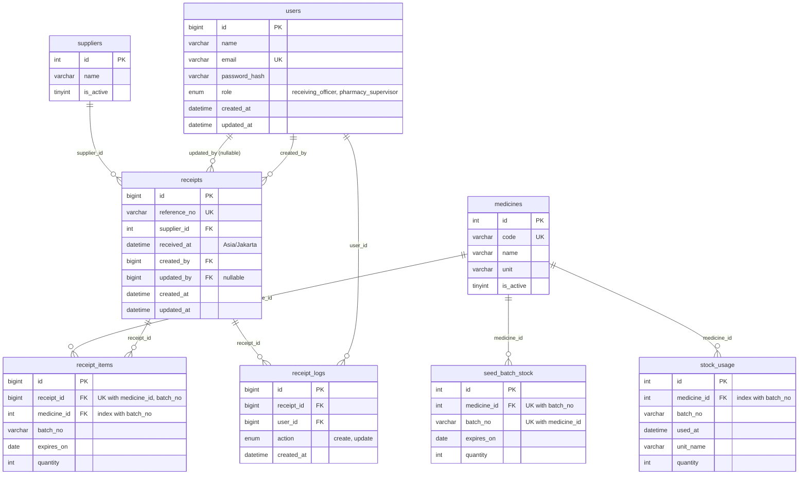

# Database Schema (ERD)

```mermaid
erDiagram
    users ||--o{ receipts : "created_by"
    users ||--o{ receipts : "updated_by (nullable)"
    users ||--o{ receipt_logs : "user_id"
    suppliers ||--o{ receipts : "supplier_id"
    receipts ||--o{ receipt_items : "receipt_id"
    receipts ||--o{ receipt_logs : "receipt_id"
    medicines ||--o{ receipt_items : "medicine_id"
    medicines ||--o{ seed_batch_stock : "medicine_id"
    medicines ||--o{ stock_usage : "medicine_id"

    users {
        bigint id PK
        varchar name
        varchar email UK
        varchar password_hash
        enum role "receiving_officer, pharmacy_supervisor"
        datetime created_at
        datetime updated_at
    }

    suppliers {
        int id PK
        varchar name
        tinyint is_active
    }

    medicines {
        int id PK
        varchar code UK
        varchar name
        varchar unit
        tinyint is_active
    }

    seed_batch_stock {
        int id PK
        int medicine_id FK "UK with batch_no"
        varchar batch_no "UK with medicine_id"
        date expires_on
        int quantity
    }

    stock_usage {
        int id PK
        int medicine_id FK "index with batch_no"
        varchar batch_no
        datetime used_at
        varchar unit_name
        int quantity
    }

    receipts {
        bigint id PK
        varchar reference_no UK
        int supplier_id FK
        datetime received_at "Asia/Jakarta"
        bigint created_by FK
        bigint updated_by FK "nullable"
        datetime created_at
        datetime updated_at
    }

    receipt_items {
        bigint id PK
        bigint receipt_id FK "UK with medicine_id, batch_no"
        int medicine_id FK "index with batch_no"
        varchar batch_no
        date expires_on
        int quantity
    }

    receipt_logs {
        bigint id PK
        bigint receipt_id FK
        bigint user_id FK
        enum action "create, update"
        datetime created_at
    }
```
